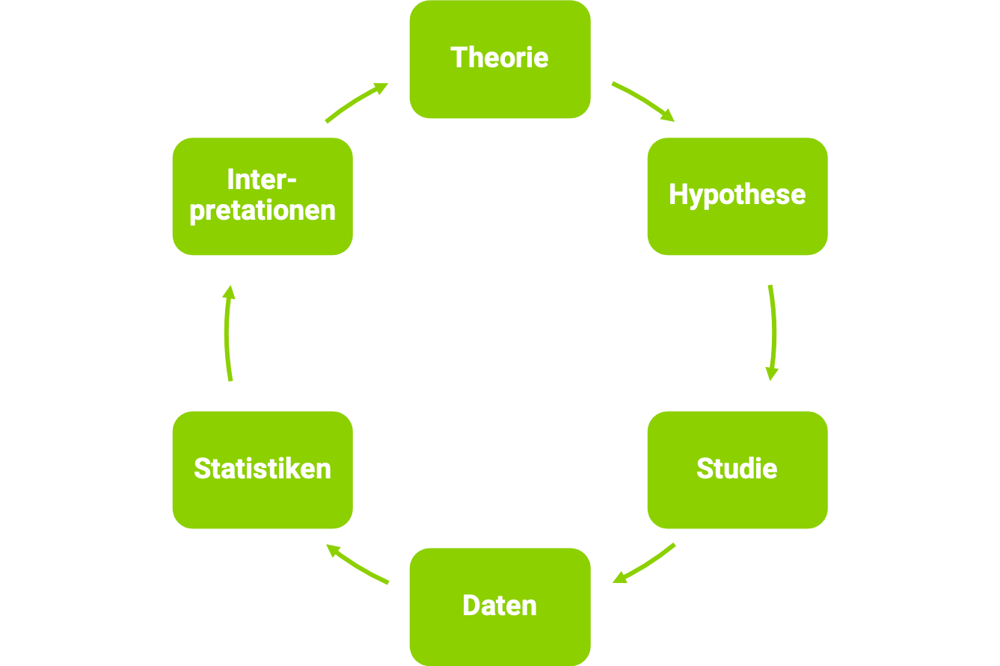

# Heutige Vorlesung

* Organisatorische Einführung  
* Motivation: Warum Bildungs-Wissenschaft 
* Ihre Fragen


#  Organisatorische Einführung


> Die Vorlesung wird als Partially Flipped Lesson ausgebracht.
* Teilweise Erklärvideos und Aufgaben vorab. Diese können zu einem beliebigen Zeitpunkt rezipiert/bearbeitet werden.
* Mittwochs 10:00 - 11:30 synchrone Sitzung mit Elaboration (vertiefende Aufgaben), FAQ (offene Fragen), neuen Inhalten.


# Organisatorische Einführung
## Studienleistung
> 4CP $\Rightarrow$ 8h wöchentlich  
> Videos durcharbeiten, ergänzend lesen, Aufgaben bearbeiten (Cut-Off: 50% der Punkte) 


# Organisation via moodle
```{r, echo = F, out.width="75%", fig.align='center'}
knitr::include_graphics("img/screenshot_moodle2.png")
```


# Motivation: Warum *Bildungs-*Wissenschaft  

## Wiss. vs. nicht-wiss. generiertes Wissen
> Wissen kann von Autoritäten generiert werden, durch Intuition, spontane Beobachtung etc.. Wissenschaftlich generiertes Wissen hat nichtwissenchaftlichen Quellen gegenüber Vor- aber auch Nachteile. Bitte geben Sie unter https://bit.ly/merk012 an, welche Vor- und Nachteile Sie in wiss. produziertem Wissen sehen und "voten" Sie die Antworten Ihrer Kommiliton*innen. Schreiben Sie dazu _Vorteil: ...._ oder _Nachteil: ... _


# Wissenschaftstheorie - Methodologie - Methoden

# Was ist Wissenschaft?
> Wer wissenschaftliche Forschung („scientific research“) betreibt, sucht mithilfe anerkannter wissenschaftlicher Methoden und Methodologien auf der Basis des bisherigen Forschungsstandes (d. h. vorliegender Theorien und empirischer Befunde) zielgerichtet nach gesicherten neuen Erkenntnissen, dokumentiert den Forschungsprozess sowie dessen Ergebnisse in nachvollziehbarer Weise und stellt die Studie in Vorträgen und Publikationen der Fachöffentlichkeit vor. (Döring & Bortz, 2019)


### Differenz zu Wissensgenese durch
* Autoritätspersonen $\Rightarrow$ geringeres Eigeninteresse ...
* gesunder Menschenverstand $\Rightarrow$ variiert sehr stark zwischen sozialen Gruppen ...
* Intuition $\Rightarrow$ geringere Vorurteile, geringeres Wunschdenken ...
* Anektotische Evidenz $\Rightarrow$ objektivere & vollständigere Beobachtung ...
* ...


# Inhalte der Vorlesung - und deren Motivation 


## Eine kompetenztheoretische Begründung:

"_Kompetenzen sind latente, domänenspezifische Dispositionen, die die erfolgreiche Problemlösung wahrscheinlicher machen_"


#### Bsp. Mathematik
"_Hr. Müller fährt auf der Autobahn, sieht auf einer App, dass die nächsten Tankstellen in 3km, 65km und 120km kommen mit den Preisen 1,49€, 1,45€ und 1,38€. Ein Blick auf das Amaturenbrett verrät ihm, dass sein Tank noch zu einem Achtel gefüllt ist, weshalb er sich fragt, bis zu welcher Tankstelle er fahren sollte._"


#### Bsp. GPK 
"_Hr. Müller möchte seine 8. Klasse anhand eines Arbeitsblattes in das stöchiometrische Rechnen (Chemie) einführen. Er fragt sich ob er mit einem Beispiel anfangen soll oder mit einem Problem; ob er Farbe verwenden soll und wenn ja welche; ob er Formelschreibweise oder Teilchenmodelle verwenden soll; die Legende am Rand oder ins Bild integriert sein soll, etc. _"

```{r, echo = F, fig.align='center', out.width="70%", fig.cap="Trade Off von Anwendungsspektrum und Passung"}
knitr::include_graphics("img/TradeOff.png")
```


## Eine bildungstheoretische Begründung:


## Eine kognitionspsychologische Begründung

```{r, echo=FALSE, fig.cap="Ebbinghaustäuschung (Massaro & Anderson, 1971)", out.width="60%"}
knitr::include_graphics("img/Ebbinghaus.png")
```


### Menschliche Wahrnehmung ist verzerrt
* Confirmation Bias (Nickerson, 1998)
* Anchor Bias (Tversky & Kahneman, 1974)
* Hindsight Bias (Langfeldt, 1989)
* Positive Testing (Snyder & Swann, 1978)

### Verzerrung relevant sowohl
* in der Alltagswarnehmung
* als auch der Wahrnung wissenschaftlicher Ergebnisse/Evidenz $\rightarrow$ siehe soeben durchgeführtes Experiment


# Hedonistische Begründung 


### It's fun:


```{r, echo = F, message=FALSE}
library(flextable)
library(tidyverse)
flextable(
  tibble(
    Fakultät = c("Studenten", "Studentinnen"),
    `Fakultät A` = c("100%", "90%"),
    `Fakultät B` = c("60%", "50%"))) %>% 
  width(width = .95) %>% 
  color(color = "white", part = "all")
```


```{r, echo = F}
flextable(
  tibble(
    Gruppe = c("Studenten", "Studentinnen"),
    `Fakultät A` = c("200/200", "900/1000"),
    `Fakultät B` = c("600/1000", "100/200"),
    `Gesamt %` = c("~67%", "~83%")))  %>% 
  width(width = .95) %>% 
  color(color = "white", part = "all")
```


Tabellen stellen sog. Simpsons Paradox (Simpson, 1951) dar.


# Was kommt auf Sie zu?

# Der Evidenzbegriff


# Arbeitsdefinition: »Evidenz«
> Evidenz meint, die Vereinbarkeit einer Beobachtung mit einer Hypothese. 

> Relative Evidenz meint, die Vereinbarkeit einer Beobachtung mit einer Hypothese im Vergleich zur Vereinbarkeit mit einer anderen Hypothese. 


# Beispiel: Evidenz?

# Das Hempel-Oppenheim-Schema (HOS)
```{r, fig.cap="Das Hempel-Oppenheimer-Schema", echo = F, out.width="65%", fig.align='center'}

```

# Systematisierung (quantitativer Studien) in den Sozialwissenschaften

## Empirische, theoretische & methodische Studien

> Empirisch meint _auf Beobachtungen beruhend_ die zielgerichtet für die Forschungsfrage generiert wurden.
> Theoretisch meint _nicht direkt auf Beobachtungen/Daten_ beziehend (nicht-empirisch).  
> Methodisch meint _eine wissenschaftliche Methode untersuchend_.

### Beispiele (Auszüge aus Abstracts):
"Der Beitrag diskutiert die Bedeutung von Meta-Reflexivität für die Professionalität im Lehrerinnen- und Lehrerberuf. Meta-Reflexivität beruht erstens auf der für die Lehrerbildung konstitutiven Mehrperspektivität, die wiederum auf die vielfältigen an ihr beteiligten Disziplinen und Studienelemente zurückgeht. Zweitens greift der Ansatz Ungewissheit als konstitutives Merkmal der gängigen Professionstheorien zum Lehrerinnen- und Lehrerberuf auf. Ausgehend von einer historisch-systematischen Rekonstruktion wird Meta-Reflexivität als ein Element von Professionalität entfaltet (...)" (Cramer et al., 2019) .
"Recent reports show that fewer adolescents believe that regular cannabis use is harmful to health. Concomitantly, adolescents are initiating cannabis use at younger ages, and more adolescents are using cannabis on a daily basis. The purpose of the present study was to test the association between persistent cannabis use and neuropsychological decline and determine whether decline is concentrated among adolescent-onset cannabis users. Participants were members of the Dunedin Study, a prospective study of a birth cohort of 1,037 individuals followed from birth (1972/1973) to age 38 y. Cannabis use was ascertained in interviews at ages 18, 21, 26, 32, and 38 y (...)" (Meier et al., 2012).

--

➡ Theoretische Studie

--

➡︎ Empirische Studie


## Primär-, Sekundär-, Meta-, Metametastudien
> _Bei der Primärstudie ist die Datengrundlage ein selbst generierter Datensatz.  
Bei der Sekundärstudie werden bereits vorhandene Datensätze erneut analysiert.  
Bei der Metaanalyse greift man aus einer mehr oder minder großen Menge vergleichbarer Studien zum selben Sachverhalt die berichteten statistischen Ergebnisse heraus und rechnet mit diesen weiter._  
(Döring & Bortz, 2016)

--

### Beispiele (Abstracts):
"Suspension of face-to-face instruction in schools during the COVID-19 pandemic has led to concerns about consequences for students’ learning. So far, data to study this question have been limited. Here we evaluate the effect of school closures on primary school performance using exceptionally rich data from The Netherlands (n ≈ 350,000). We use the fact that national examinations took place before and after lockdown and compare progress during this period to the same period in the 3 previous years. (...)" (Engzell et al., 2021) .
.em07"Kinder mit sprachlichem Migrationshintergrund stehen beim Erwerb sprachlicher Kompetenzen in der Schule vor besonderen Herausforderungen. Wir untersuchen Stereotypenbedrohung als mögliche Ursache für einen geringeren Wortschatzzuwachs. N = 118 Kinder mit sprachlichem Migrationshintergrund aus 18 Grundschulklassen der vierten Jahrgangsstufe wurden randomisiert einer expliziten, einer impliziten oder keiner Stereotypenbedrohung ausgesetzt und sollten im Anschluss schwierige Wörter erlernen. Erwartungsgemäß war der Wortschatzzuwachs in den beiden Bedrohungsbedingungen, insbesondere in der expliziten, geringer als in der Kontrollbedingung.  (...)" (Sander et al., 2018).


## Deskriptive, explanative, explorative Studien

> Deskriptive Studien zielen auf die Beschreibung der Verteilung von Variablen in der Population ab.
> Explanative Studien zielen auf die Verifikation/Falsifikation bestehender Kausalhypothesen ab.  
> Explorative Studien zielen auf die Genese von Hypothesen ab.

### Beispiele (Abstracts):
"Suspension of face-to-face instruction in schools during the COVID-19 pandemic has led to concerns about consequences for students’ learning. So far, data to study this question have been limited. Here we evaluate the effect of school closures on primary school performance using exceptionally rich data from The Netherlands (n ≈ 350,000). We use the fact that national examinations took place before and after lockdown and compare progress during this period to the same period in the 3 previous years. (...)" (Engzell et al., 2021) .
.em07"Kinder mit sprachlichem Migrationshintergrund stehen beim Erwerb sprachlicher Kompetenzen in der Schule vor besonderen Herausforderungen. Wir untersuchen Stereotypenbedrohung als mögliche Ursache für einen geringeren Wortschatzzuwachs. N = 118 Kinder mit sprachlichem Migrationshintergrund aus 18 Grundschulklassen der vierten Jahrgangsstufe wurden randomisiert einer expliziten, einer impliziten oder keiner Stereotypenbedrohung ausgesetzt und sollten im Anschluss schwierige Wörter erlernen. Erwartungsgemäß war der Wortschatzzuwachs in den beiden Bedrohungsbedingungen, insbesondere in der expliziten, geringer als in der Kontrollbedingung. (...)" (Sander et al., 2018).


# Messwiederholte Studie, querschnittliche Studie
```{r, echo = F, out.width="80%", fig.align='center'}
knitr::include_graphics("img/longi.png")
```


# Loborstudie, Feldstudie


# Experiment, Quasi- und Nicht-Experiment

```{r, echo = F, out.width="80%", fig.align='center'}
knitr::include_graphics("img/exp_quasiexp.png")
```


# Experiment, Quasi- und Nicht-Experiment

```{r, echo = F}
knitr::include_graphics("img/flowchart_exp_quasiexp.png")
```


# Experiment, Quasi- und Nicht-Experiment

### Beispiele (Abstracts):
"(...) Der vorliegende Beitrag untersucht die Frage, ob sich Abiturientinnen und Abiturienten aus G8- und G9-Jahrgängen in Baden-Württemberg im Hinblick auf verschiedene Kompetenzbereiche sowie in ihren Selbstberichten zu ihrer schulischen Beanspruchung, ihren gesundheitlichen Beschwerden und in ihrem Freizeitverhalten unterschieden. Die Analysen beruhen auf Daten von vier Kohorten der Zusatzstudie Baden-Württemberg des Nationalen Bildungspanels: der letzte reine G9-Jahrgang (N = 1341), der G9-Doppeljahrgang (N = 1284), der G8-Doppeljahrgang (N = 1293) und der erste reine G8-Jahrgang (N = 1292) ...."  (Hübner et al., 2017) .
"Kinder mit sprachlichem Migrationshintergrund stehen beim Erwerb sprachlicher Kompetenzen in der Schule vor besonderen Herausforderungen. Wir untersuchen Stereotypenbedrohung als mögliche Ursache für einen geringeren Wortschatzzuwachs. N = 118 Kinder mit sprachlichem Migrationshintergrund aus 18 Grundschulklassen der vierten Jahrgangsstufe wurden randomisiert einer expliziten, einer impliziten oder keiner Stereotypenbedrohung ausgesetzt und sollten im Anschluss schwierige Wörter erlernen. Erwartungsgemäß war der Wortschatzzuwachs in den beiden Bedrohungsbedingungen, insbesondere in der expliziten, geringer als in der Kontrollbedingung.  (...)" (Sander et al., 2018).


# Experimentelle  Studien
> _"Die experimentelle Studie/randomisierte kontrollierte Studie („experimental study“) bildet für die Prüfung einer Kausalhypothese zunächst künstlich nach dem Zufallsprinzip mindestens zwei Gruppen, behandelt diese systematisch unterschiedlich und misst die in den Experimental- und Kontrollgruppen resultierenden Effekte auf die abhängige/n Variable/n."_ Döring & Bortz, 2016


# Quasiexperimentelle Studien

> _"Die quasi-experimentelle Studie greift zur Prüfung einer Kausalhypothese auf Gruppen zurück, die nicht zufällig zusammengestellt, sondern oft einfach vorgefunden oder anderweitig gebildet wurden (keine Randomisierung), behandelt diese jedoch ebenso wie im echten Experiment systematisch unterschiedlich und misst die in den Experimental- und Kontrollgruppen resultierenden Effekte auf die abhängige/n Variable/n."_ Döring & Bortz, 2016


# Nicht-experimentelle Studien
> _"Eine nicht-experimentelle Studie („non-experimental study“, „descriptive study“) greift auf vorgefundene Gruppen zurück (keine Randomisierung) und betrachtet deren vorgefundene Unterschiede"_ Döring & Bortz, 2016

# Methodische Strenge als Qualitätmerkmal

# Kriterien der wissenschaftlichen Qualität  
* Relevanz
* Ethische Strenge
* Methodische Strenge
    * Konstruktvalidität
    * Interne Validität
    * Externe Validität
    * Statistische Validität
* Präsentationsqualität  


## Definition: Interne Validität
> Eine Studie - bzw. genauer - die aus ihr gewonnenen Erkenntnisse, gelten als intern valide, wenn die untersuchten Variablenzusammenhänge mit hoher Sicherheit als kausale Ursache-Wirkungs-Relationen zu interpretieren sind. Döring & Bortz, 2016

## Steigerung der internen Validität durch
* Größere Stichprobe
* Experimentelle Studiendesigns
* Längsschnittliche Studiendesigns
* Matching Studien


## Definition: Externe Validität
> Eine Studie – bzw. genauer: die aus ihr gewonnenen Erkenntnisse – gelten in dem Maße als extern valide, wie sich die Ergebnisse auf andere Orte, Zeiten, Operationalisierungen der abhängigen und unabhängigen Variablen oder auf andere Personen als die konkret untersuchten verallgemeinern lassen. Döring & Bortz, 2016

## Steigerung der externen Validität durch
* Größere Stichprobe
* Feldstudien
* Längsschnittliche Studiendesigns
* Repräsentative Stichproben
* Metaanalysen
* Multiple Operationalisierungen

